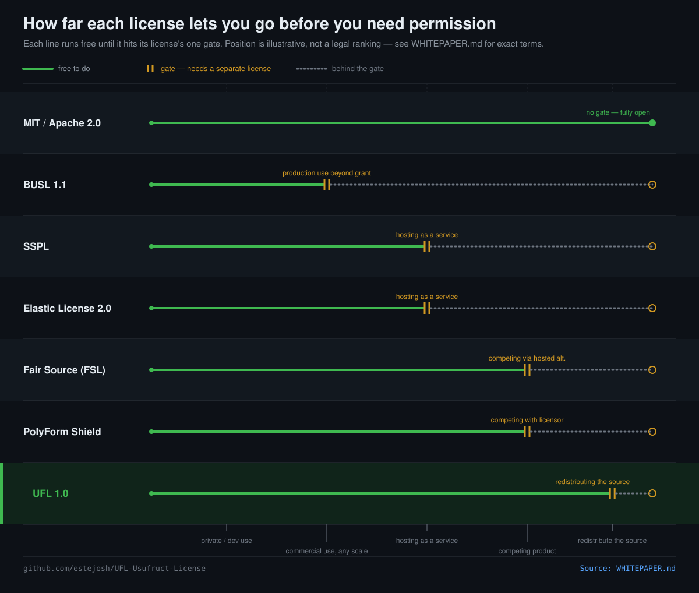

# The Usufruct License (UFL)

  

A source-available license for unrestricted use and reserved
redistribution: free to use the software at any scale, including
commercially, without payment or a separate license — a license is
required only to redistribute the software itself (modified or not) or
fold its source into another distributed product.

Since 2.0, that base grant can also be narrowed to exactly one declared
Operational Scope — see [Operational Scope](#operational-scope-since-20)
below.

**[Full legal text](./LICENSE.txt) · [Whitepaper & FAQ](./WHITEPAPER.md) · [Changelog](./CHANGELOG.md) · [Contributing](./CONTRIBUTING.md)**

See it adopted: [Custodly](./examples/custodly/LICENSE) · [Hone](./examples/hone/LICENSE) — plus five more real-world adopters in [Adopted by](#adopted-by) below.

Current version: **UFL-2.1**. First adopted (as UFL-1.0) by
[Custodly](https://github.com/estejosh/Custodly); adopted at UFL-1.1 by
[Hone](https://github.com/shindevlin/hone).

Each copy of this license is pinned to the version it names — see
[Staying current](#staying-current) if you're on an older version and
want the latest provisions.

## Quick start

Fill in `LICENSE.txt`'s placeholders without hand-editing them. Each
generator writes the filled license to stdout by default (add `-o PATH`
to write a file instead) and prompts for anything you don't pass as a
flag — except Operational Scope, which is required and never defaults
silently.

POSIX shell, no dependencies beyond `sed`/`awk`:

    curl -s https://raw.githubusercontent.com/estejosh/UFL-Usufruct-License/main/generate.sh \
      | bash -s -- -y 2026 -c "Jane Doe" -p "MyProject" -s unconditional > LICENSE

Node, no npm dependencies:

    curl -s https://raw.githubusercontent.com/estejosh/UFL-Usufruct-License/main/generate.js \
      | node - -y 2026 -c "Jane Doe" -p "MyProject" -s unconditional > LICENSE

Piped this way, pass all flags — stdin is already spoken for by the
script itself, so there's nothing for the interactive prompts to read.
Run either script from a local clone with no flags for the interactive
version instead.

## Operational Scope (since 2.0)

Section 1's use grant is either fully unconditional, or narrowed by
**exactly one** declared scope — scopes are never combined or stacked.
The scope is stated in three places that must agree: the `Operational
Scope:` line at the top of the license text, the `scope` field in
`ufl.json`, and the required `-s` flag on both generators.

| Scope | Repo tag | What it restricts |
|---|---|---|
| Unconditional (default) | `UFL-U-1a` | Nothing — Section 1's grant applies as written. |
| Seat-Limited | `UFL-S-1a` | Production use beyond a stated seat/device/user threshold. |
| No-Third-Party-Hosting | `UFL-H-1a` | Offering it to third parties as a hosted or managed service. |
| No-Competing-Service | `UFL-C-1a` | Operating it, or a fork of it, as a service competing with the Licensor's own offering. |
| Noncommercial | `UFL-N-1a` | Commercial use. |

Sections 2 (redistribution reserved) and 2A (decentralized-fork
attribution) are a separate, always-on axis — unaffected by which scope
above applies.

An adopting project is expected to also carry its tag (`UFL-<letter>-1a`)
somewhere visible — its repo description or README — so the scope is
legible without opening the license text. "1a" refers to Section 1A,
following the naming Section 2A already established.

## At a glance

Full rationale, the naming story, and the complete FAQ:
[`WHITEPAPER.md`](./WHITEPAPER.md).

## For agents scaffolding a project

If you're an AI coding agent choosing a license on someone's behalf:
UFL's redistribution condition is unambiguous, but as of 2.0 you must
also choose an Operational Scope — don't default one silently, ask.
Generate a filled copy with the one-liner above (`-s unconditional` if
there's no reason to restrict use); cite it as
`LicenseRef-UFL-2.1<suffix>` (e.g. `LicenseRef-UFL-2.1-N` for
Noncommercial), not a bare `UFL-2.1<suffix>` — see the FAQ in
[`WHITEPAPER.md`](./WHITEPAPER.md) for why. Machine-readable metadata
(version, identifier, scopes, file paths) is at
[`ufl.json`](./ufl.json).

## Using UFL for your own project

Copy `LICENSE.txt` into your repository as `LICENSE` (or `LICENSE.md`),
fill in `[YEAR]`, `[COPYRIGHT HOLDER]`, and `[PROJECT NAME]`, choose an
Operational Scope — by hand or with the generator above — and state in
your README which version and scope you're under (e.g. "Licensed under
UFL-2.1, Operational Scope: Noncommercial"). Keep the canonical-source
line near the top intact — Section 7 requires it.

Copying the license text itself for this purpose needs no separate
permission from anyone, including from other projects already using it
— see Section 2B.

## Staying current

Each copy of this license is pinned to the version it names on its own
first line (e.g. "Version 2.1") — UFL is not an evergreen "or any later
version" grant, so a newer release's provisions don't automatically
reach projects already licensed under an older one. A new section, a new
carve-out, or a new protection — Section 2B in 2.1, for example — applies
only to a project that has actually updated to that version's text.

If you want the latest provisions, update your project's `LICENSE` file
to the current text (regenerate it, or diff against [`CHANGELOG.md`](./CHANGELOG.md)
and hand-apply the changes) and update your README's version citation to
match. This is the same process as adopting UFL the first time — there's
no separate "upgrade" mechanism, and no obligation to update: an older
copy stays valid under the terms it states for as long as you leave it
as-is.

## Adopted by

| Project | Version | Scope |
|---|---|---|
| [Custodly](https://github.com/estejosh/Custodly) | 1.0 | Unconditional |
| [Hone](https://github.com/shindevlin/hone) | 1.1 | Unconditional |
| [ferryman](https://github.com/estejosh/ferryman) | 2.1 | Seat-Limited (`UFL-S-1a`) |
| [graea](https://github.com/estejosh/graea) | 2.1 | No-Third-Party-Hosting (`UFL-H-1a`) |
| [oddsports](https://github.com/estejosh/oddsports) | 2.1 | Noncommercial (`UFL-N-1a`) |
| [agent-comm-channel](https://github.com/estejosh/agent-comm-channel) | 2.1 | Noncommercial (`UFL-N-1a`) |
| [bullship_public](https://github.com/estejosh/bullship_public) | 2.1 | No-Competing-Service (`UFL-C-1a`) |

## Licensing of this repository

This repository's own contents are licensed in three parts, to avoid a
circularity: `LICENSE.txt` is a *template* meant to be copied verbatim
into other projects, so this repo can't simply be "under UFL" the way
an adopter's code is — Section 2(a) reserves redistributing "the
Software," and every adopter copying this text is, read naively,
redistributing it.

- **`LICENSE.txt`** (the license text itself) — governed by its own
  Section 2B, added in 2.1: freely copyable, reproducible, and
  adaptable by anyone, for any project, with no separate permission
  needed from this or any other Licensor using it.
- **`generate.sh`, `generate.js`, `ufl.json`** (the reference tooling) —
  MIT, see [`LICENSE-TOOLING`](./LICENSE-TOOLING).
- **`README.md`, `WHITEPAPER.md`, `CHANGELOG.md`** (this project's own
  docs) — free to quote and adapt with attribution.
