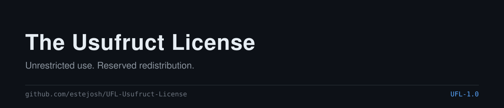
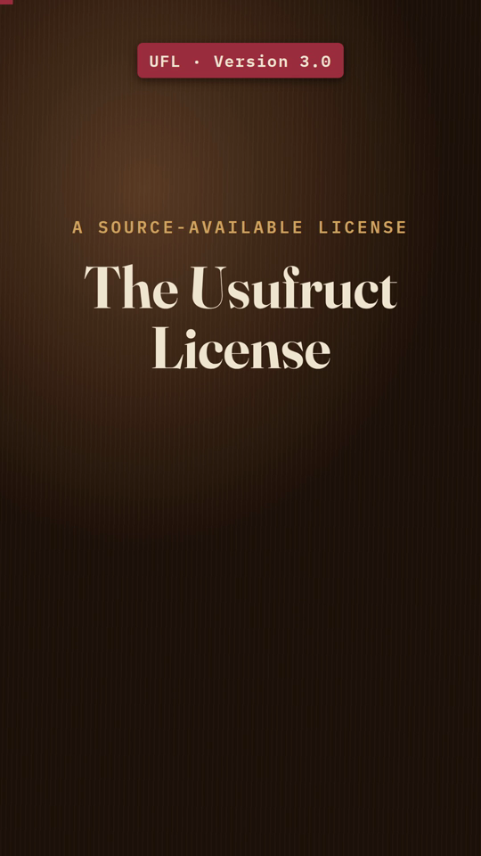

# The Usufruct License (UFL)

<p align="center">
  
</p>

<p align="center">
<a href="./LICENSE.txt"></a>
<a href="./WHITEPAPER.md#faq"></a>
<a href="./examples/custodly/LICENSE"></a>
<a href="./examples/hone/LICENSE"></a>
</p>

A source-available license for unrestricted use and reserved
redistribution: free to use the software at any scale, including
commercially, without payment or a separate license — a license is
required only to redistribute the software itself (modified or not) or
fold its source into another distributed product.

Since 2.0, that base grant can also be narrowed to exactly one declared
Operational Scope — see [Operational Scope](#operational-scope-since-20)
below. Since 3.0, the license itself also sets how a use the scope
withholds is paid for: at the Licensor's published price, on the
license's own terms, with no side agreement. See [Paid use](#paid-use-since-30). Since 3.1, it
also says what a contributor gives the project — see
[Contributions](#contributions-since-31).

**[Full legal text](./LICENSE.txt) · [Reference PDFs](./pdf) · [Whitepaper & FAQ](./WHITEPAPER.md) · [Changelog](./CHANGELOG.md) · [Contributing](./CONTRIBUTING.md)**

<p align="center">
  <a href="./assets/ufl-3.0-explainer.mp4"></a><br>
  <a href="./assets/ufl-3.0-explainer.mp4">Watch the UFL 3.0 explainer (1:52)</a>
</p>

See it adopted: [Custodly](./examples/custodly/LICENSE) · [Hone](./examples/hone/LICENSE) — plus five more real-world adopters in [Adopted by](#adopted-by) below.

Current version: **UFL-3.3**. First adopted (as UFL-1.0) by
[Custodly](https://github.com/estejosh/Custodly); adopted at UFL-1.1 by
[Hone](https://github.com/shindevlin/hone).

Each copy of this license is pinned to the version it names, and its text
is fixed — see [Staying current](#staying-current) if you're on an older
version and want the latest provisions, and Section 2C if you're wondering
what you're allowed to change (short answer: three placeholders and one
scope choice, nothing else).

## Quick start

Fill in `LICENSE.txt`'s placeholders without hand-editing them. Each
generator writes the filled license to stdout by default (add `-o PATH`
to write a file instead) and prompts for anything you don't pass as a
flag — except Operational Scope, which is required and never defaults
silently.

POSIX shell, no dependencies beyond `sed`/`awk`:

    curl -s https://raw.githubusercontent.com/estejosh/UFL-Usufruct-License/main/generate.sh \
      | bash -s -- -y 2026 -c "Jane Doe" -p "MyProject" -s unconditional > LICENSE

Node, no npm dependencies:

    curl -s https://raw.githubusercontent.com/estejosh/UFL-Usufruct-License/main/generate.js \
      | node - -y 2026 -c "Jane Doe" -p "MyProject" -s unconditional > LICENSE

Piped this way, pass all flags — stdin is already spoken for by the
script itself, so there's nothing for the interactive prompts to read.
Run either script from a local clone with no flags for the interactive
version instead.

Both generators only ever fill in `[YEAR]`, `[COPYRIGHT HOLDER]`,
`[PROJECT NAME]`, and the single Operational Scope you pass with `-s` —
they don't give you a way to change anything else in the text, on
purpose. See Section 2C.

## Operational Scope (since 2.0)

Section 1's use grant is either fully unconditional, or narrowed by
**exactly one** declared scope — scopes are never combined or stacked.
The scope is stated in three places that must agree: the `Operational
Scope:` line at the top of the license text, the `scope` field in
`ufl.json`, and the required `-s` flag on both generators.

| Scope | Repo tag | What it restricts |
|---|---|---|
| Unconditional (default) | `UFL-U-1a` | Nothing — Section 1's grant applies as written. |
| Seat-Limited | `UFL-S-1a` | Production use beyond a stated seat/device/user threshold (Paid Use above it). |
| No-Third-Party-Hosting | `UFL-H-1a` | Offering it to third parties as a hosted or managed service. |
| No-Competing-Service | `UFL-C-1a` | Operating it, or a fork of it, as a service competing with the Licensor's own offering. |
| Noncommercial | `UFL-N-1a` | Commercial use. |
| Decentralized | `UFL-D-1a` | Nothing is withheld and nothing is paid. Disputes go to exclusive online ICC arbitration, and each party's liability to the other is limited to US$1 in value, payable in money or the project's native token (`-k`, optional). |

Sections 2 (redistribution reserved) and 2A (decentralized-fork
attribution) are a separate, always-on axis — unaffected by which scope
above applies.

## Paid use (since 3.0)

Every scope except Unconditional withholds something from the free
grant. Under 3.0 that use is **Paid Use** (Section 8): licensed under UFL
itself, on all of its terms, at the price the Licensor publishes in the
repo or docs. The price is a number, never extra terms. If someone uses
past the scope without paying, Section 12 licenses it after the fact:
the published price if they disclose it first, three times that if the
Licensor finds it, plus interest, three years back at most. The grant is
never revoked for nonpayment (Section 13). Payment disputes go to
mediation, then ICC arbitration seated in California, by video if the
parties want (Section 14). Using the software on the free grant puts
no one in that process. Section 15 makes the license the whole deal: no
side documents, no side terms.

For a project on Seat-Limited, Noncommercial, No-Third-Party-Hosting, or
No-Competing-Service, that means publishing a price list somewhere in
the repo or docs. Nothing else.

## Releases (since 3.2)

A project can change its license over time without changing the terms
of software people already have. With each Release, state which version
of UFL and which Operational Scope rules that Release, and ship the
license text with it:

```
./generate.sh -r -s noncommercial
UFL 3.3, Operational Scope: Noncommercial (LicenseRef-UFL-3.3-N)
```

Put that line in the Release's notes, its tag, or its package metadata.

- The statement is fixed when the Release is published. The Licensor
  grants those terms perpetually and irrevocably for that Release.
- Later Releases can use a later version, another scope, or other terms.
  Anyone who keeps using the earlier Release keeps the earlier terms.
- If a Release states nothing, the license text shipped with it governs,
  or else the text in the repository at the commit it was made from.
- This is the Licensor's choice for each Release. It is not an "or any
  later version" grant, and nobody moves to a newer version on their own.

## Contributions (since 3.1)

Section 4 says what happens when someone submits a fix, change, or
addition to a UFL project. The author grants the Licensor a perpetual,
irrevocable, royalty-free license to it (patents included, and the right
to relicense it), keeps ownership, and is owed nothing. That is the
tradeoff for using the project. Submitting is agreement, and where the
Licensor requires a recorded step, such as a CLA comment, the author
completes it. The step records agreement to Section 4 and adds no term:
Section 15 means a separate CLA document cannot carry terms of its own,
so the terms are in the license and the CLA is only the record.

Git cannot enforce a license, but GitHub can refuse to merge until
agreement is on record. [`templates/cla/`](./templates/cla) is the kit:

| File | Goes to | Does |
|---|---|---|
| `cla.yml` | `.github/workflows/cla.yml` | Comments on each pull request until the author signs; fails the `CLAAssistant` check until then. |
| `CLA.md` | repo root | The acknowledgement the bot links to. Adds no term. |
| `CONTRIBUTING.md` | repo root | Pull requests only, sign once, signed commits. |
| `setup.sh` | run once | Creates the `cla-signatures` branch and requires a pull request, the `CLAAssistant` check and signed commits on `main`, using a GitHub PAT in `$GITHUB_PAT`. |

What it does and does not do:

- It means something only under **3.1 or later**. The Section 4 in 3.0 and
  earlier grants back only "to the extent necessary to keep this license
  enforceable."
- The signature is a line in `signatures/cla.json` on the `cla-signatures`
  branch, tied to the contributor's GitHub account. It does not depend on
  the merged commit. A squash merge replaces the contributor's commits with
  one commit authored by whoever merged, so the contributor's signature on
  their own commits is not in the project's history, and a `Signed-off-by`
  trailer survives only if the merge message keeps it. That is why this
  uses a CLA record and not a DCO sign-off.
- Signed commits show who made a commit before it is merged. After a
  squash or web merge the commit is signed by the merger (GitHub signs web
  merges), so the evidence of agreement is the CLA record plus the pull
  request, not the merged commit.
- It cannot stop anyone pushing to their own fork or sending a patch
  elsewhere. It controls only what the project accepts.
- A pull request from an automated agent is submitted by whoever runs the
  agent. Add an agent account to the `allowlist` only if its operator has
  signed.

## Reference PDFs and checksums

[`pdf/`](./pdf) holds one read-only PDF per Operational Scope, plus the
plain text it was made from, with the year, holder, and project name
left blank (and the threshold for Seat-Limited, or the native token, if any, for Decentralized):

| Scope | PDF | Text |
|---|---|---|
| Unconditional | [UFL-3.3-unconditional.pdf](./pdf/UFL-3.3-unconditional.pdf) | [.txt](./pdf/UFL-3.3-unconditional.txt) |
| Seat-Limited | [UFL-3.3-seat-limited.pdf](./pdf/UFL-3.3-seat-limited.pdf) | [.txt](./pdf/UFL-3.3-seat-limited.txt) |
| No-Third-Party-Hosting | [UFL-3.3-no-third-party-hosting.pdf](./pdf/UFL-3.3-no-third-party-hosting.pdf) | [.txt](./pdf/UFL-3.3-no-third-party-hosting.txt) |
| No-Competing-Service | [UFL-3.3-no-competing-service.pdf](./pdf/UFL-3.3-no-competing-service.pdf) | [.txt](./pdf/UFL-3.3-no-competing-service.txt) |
| Noncommercial | [UFL-3.3-noncommercial.pdf](./pdf/UFL-3.3-noncommercial.pdf) | [.txt](./pdf/UFL-3.3-noncommercial.txt) |
| Decentralized | [UFL-3.3-decentralized.pdf](./pdf/UFL-3.3-decentralized.pdf) | [.txt](./pdf/UFL-3.3-decentralized.txt) |

The 3.0 PDFs stay in [`pdf/`](./pdf) under their own names, unchanged.

Each PDF footer carries the SHA-256 of its license text, and
[`SHA256SUMS`](./SHA256SUMS) lists the hash of every release file. To
check a copy:

    sha256sum -c SHA256SUMS

The PDFs and generators are built from one source in [`src/`](./src)
(`build.py` renders `LICENSE.txt` and both generators; `make_pdfs.py`
renders the PDFs and `SHA256SUMS`).

An adopting project is expected to also carry its tag (`UFL-<letter>-1a`)
somewhere visible — its repo description or README — so the scope is
legible without opening the license text. "1a" refers to Section 1A,
following the naming Section 2A already established.

## At a glance


Full rationale, the naming story, and the complete FAQ:
[`WHITEPAPER.md`](./WHITEPAPER.md).

## For agents scaffolding a project

If you're an AI coding agent choosing a license on someone's behalf:
UFL's redistribution condition is unambiguous, but as of 2.0 you must
also choose an Operational Scope — don't default one silently, ask.
Generate a filled copy with the one-liner above (`-s unconditional` if
there's no reason to restrict use); cite it as
`LicenseRef-UFL-3.3<suffix>` (e.g. `LicenseRef-UFL-3.3-N` for
Noncommercial), not a bare `UFL-3.3<suffix>` — see the FAQ in
[`WHITEPAPER.md`](./WHITEPAPER.md) for why. Machine-readable metadata
(version, identifier, scopes, file paths) is at
[`ufl.json`](./ufl.json).

Do not rewrite, trim, or "clean up" any of the license text beyond
filling the three placeholders and picking one scope — see Section 2C.
If a project's needs don't fit any of the six scopes, that is a reason
to pick a different license or propose a new scope for a future UFL
version, not to hand-edit this one.

## Using UFL for your own project

Copy `LICENSE.txt` into your repository as `LICENSE` (or `LICENSE.md`),
fill in `[YEAR]`, `[COPYRIGHT HOLDER]`, and `[PROJECT NAME]`, choose an
Operational Scope — by hand or with the generator above — and state in
your README which version and scope you're under (e.g. "Licensed under
UFL-3.3, Operational Scope: Noncommercial"). Keep the canonical-source
line near the top intact — Section 7 requires it.

Copying the license text itself for this purpose needs no separate
permission from anyone, including from other projects already using it
— see Section 2B. That permission does not extend to changing the
text: beyond the placeholders and your scope choice, the wording is
fixed, and a modified copy can't be presented as UFL — see Section 2C.
If UFL's terms don't work for you as written, use a different license,
or propose a change for a future version instead of altering this one.

## Staying current

Each copy of this license is pinned to the version it names on its own
first line (e.g. "Version 3.3") — UFL is not an evergreen "or any later
version" grant, so a newer release's provisions don't automatically
reach projects already licensed under an older one. A new section, a new
carve-out, or a new protection — Section 2B and 2C in 2.1/2.2, or the
paid-use terms in 3.0, the contribution terms in 3.1, or the release pinning in 3.2, or the narrower dispute clause in 3.3, for example — applies only to a project that has actually updated to that
version's text.

If you want the latest provisions, update your project's `LICENSE` file
to the current text (regenerate it, or diff against [`CHANGELOG.md`](./CHANGELOG.md)
and hand-apply the changes) and update your README's version citation to
match. This is the same process as adopting UFL the first time — there's
no separate "upgrade" mechanism, and no obligation to update: an older
copy stays valid under the terms it states for as long as you leave it
as-is.

This cuts both ways with Section 2C: a published version's text is never
edited after release, only ever superseded by a new one. Every version's
exact text is preserved in this repository's Git commit history — nothing
is force-pushed or rewritten — and each version is dated in
[`CHANGELOG.md`](./CHANGELOG.md); every version is tagged (`v1.0`, `v1.1`, `v2.0`, `v2.1`, `v2.2`, `v3.0`, …) and has a GitHub Release, so a version is checkable by name as well as by date. A new version is tagged and released when it is merged. Tags for 1.0 through 3.0 were added after the fact and point at the commit that released each one.

## Adopted by

| Project | Version | Scope |
|---|---|---|
| [Custodly](https://github.com/estejosh/Custodly) | 1.0 | Unconditional |
| [Hone](https://github.com/shindevlin/hone) | 1.1 | Unconditional |
| [ferryman](https://github.com/estejosh/ferryman) | 2.2 | Seat-Limited (`UFL-S-1a`) |
| [graea](https://github.com/estejosh/graea) | 2.2 | No-Third-Party-Hosting (`UFL-H-1a`) |
| [oddsports](https://github.com/estejosh/oddsports) | 2.2 | Noncommercial (`UFL-N-1a`) |
| [agent-comm-channel](https://github.com/estejosh/agent-comm-channel) | 2.2 | Noncommercial (`UFL-N-1a`) |
| [bullship_public](https://github.com/estejosh/bullship_public) | 2.2 | No-Competing-Service (`UFL-C-1a`) |

## Licensing of this repository

This repository's own contents are licensed in three parts, to avoid a
circularity: `LICENSE.txt` is a *template* meant to be copied verbatim
into other projects, so this repo can't simply be "under UFL" the way
an adopter's code is — Section 2(a) reserves redistributing "the
Software," and every adopter copying this text is, read naively,
redistributing it.

- **`LICENSE.txt`** (the license text itself) — governed by its own
  Section 2B (reproduction, added in 2.1) and Section 2C (version
  fidelity — no modification beyond the placeholders and scope choice,
  added in 2.2): freely copyable and reproducible by anyone, for any
  project, with no separate permission needed from this or any other
  Licensor using it — but not editable and still called UFL.
- **`generate.sh`, `generate.js`, `ufl.json`** (the reference tooling) —
  MIT, see [`LICENSE-TOOLING`](./LICENSE-TOOLING).
- **`README.md`, `WHITEPAPER.md`, `CHANGELOG.md`** (this project's own
  docs) — free to quote and adapt with attribution.
