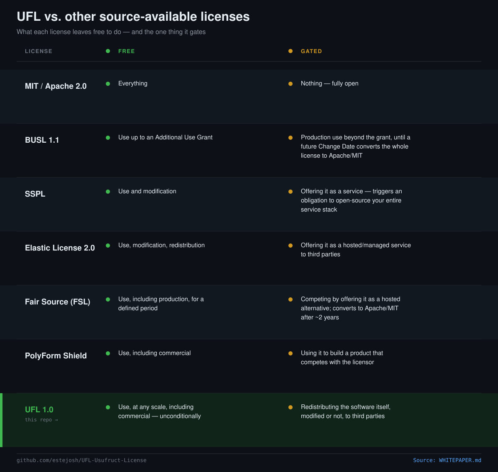

# The Usufruct License (UFL)

### A source-available license for unrestricted use and reserved redistribution

Version 1.0 — September 2026

## Abstract

Most source-available licenses gate on the wrong axis. They restrict how
*much* you can use a piece of software — production scale, seat count,
whether you're hosting it as a service, whether you compete with the
licensor. The Usufruct License gates on a different axis entirely: it
places no restriction on use, at any scale, for any purpose, including
commercial use — and reserves only the right to redistribute the
software itself, modified or not, to third parties. Use is free.
Redistribution is licensed.

## The problem with existing source-available licenses

Every major source-available license answers a slightly different
question:

| License | What's free | What's gated |
|---|---|---|
| MIT / Apache 2.0 | Everything | Nothing — fully open |
| Business Source License (BUSL 1.1) | Use up to an Additional Use Grant | Production use beyond the grant, until a future Change Date converts the whole license to Apache/MIT |
| Server Side Public License (SSPL) | Use and modification | Offering it as a service — triggers an obligation to open-source your entire service stack |
| Elastic License 2.0 | Use, modification, redistribution | Offering it as a hosted/managed service to third parties |
| Fair Source / Functional Source License (FSL) | Use, including production, for a defined period | Competing by offering it as a hosted alternative; converts to Apache/MIT after ~2 years |
| PolyForm Shield 1.0.0 | Use, including commercial | Using it to build a product that competes with the licensor |
| **Usufruct License (UFL)** | **Use, at any scale, including commercial — unconditionally** | **Redistributing the software itself, modified or not, to third parties** |

None of the existing licenses cleanly separate "you can use this
however much you want" from "you can't take the source and hand it to
someone else." BUSL, Elastic, FSL, and PolyForm all still put some limit
on *use itself* — a scale threshold, a hosting restriction, a
non-compete clause. SSPL goes the other direction and makes hosting a
service trigger a viral open-source obligation on your own stack. UFL
takes neither position: use is unconditional, and the only thing that
requires permission is handing the source itself to somebody else.

## The concept: usufruct

*Usufruct* is a civil-law property doctrine, older than any software
license: the right to use property belonging to another, and to enjoy
whatever benefit that use produces, without the right to alter the
property's substance or transfer it to someone else. A usufructuary can
live in the house, farm the land, keep what it produces — but can't sell
it, tear it down, or will it to their children. Ownership and the right
of disposal stay with the owner; the right of use passes freely to
whoever holds the usufruct.

That maps almost exactly onto what this license grants for software: use
it, build on it, profit from it, at whatever scale — but the right to
pass the thing itself on to somebody else stays with the licensor.

## How UFL works, plainly

**You can, without asking anyone or paying anything:**
- Run the software.
- Deploy it, including in a commercial product or service.
- Build on top of it through its interfaces, at any scale.
- Modify your own copy for your own use.

**You need a separate license to:**
- Give a copy — modified or not — to someone else.
- Fold the source into another product or service you distribute.
- Claim compatibility with or derivation from the project by name.

That's the whole shape of it. There's no seat count, no production
threshold, no "as a service" carve-out to interpret. The line is: does
the software (or a derivative of it) leave your hands and reach a third
party as software? If yes, that's licensed. Everything else is free.

## Naming: why "Usufruct" over the alternatives

Two other names were considered before settling on Usufruct.

**Open Custody License (OCL).** "Custody" describes the same posture —
holding something in trust, without full transfer rights — and would
have tied naturally to Custodly, the first project shipped under this
license. It was set aside for exactly that reason: a license name that
reads as tied to one project's brand doesn't travel. A future adopter of
this license, on an unrelated project, shouldn't have to explain that
"Custody" here has nothing to do with the word "Custodly."

**Sovereign Use License (SUL).** "Sovereign" already runs through this
portfolio's language — a sovereignty-first thesis behind other projects
in it, a roadmapped "sovereign vault," a "Sovereign Intelligence Node."
The license does grant sovereign, unencumbered use rights, so the name
fit thematically. It was set aside because "sovereign" describes the
*quality* of the grant (unencumbered, no one can take it from you) but
not its *shape* (use freely, don't redistribute) — and a stranger's
legal team reading it cold gets less precise information from "sovereign"
than from a term that names the actual legal mechanism.

Usufruct won because it's not a coined phrase — it's borrowed from
centuries of actual property law, so it reads as a precise description
of the grant rather than as marketing language, whether the reader is a
developer who's never heard the word or a lawyer who has.

## FAQ

**Is this open source?**
No. The Open Source Definition requires unrestricted redistribution
rights, and this license intentionally withholds those. It's
source-available: the code is public and free to read and use at any
scale, but redistribution is reserved.

**Is UFL an SPDX-recognized identifier?**
No. SPDX maintains a curated list of license identifiers, and UFL isn't
on it — inclusion requires a submission process this project hasn't
gone through. Until it is (if ever), the correct SPDX-style reference is
`LicenseRef-UFL-1.0`, the convention SPDX defines for licenses outside
its list, not a bare `UFL-1.0` as if it had been registered.

**Can I use UFL-licensed software in a commercial product?**
Yes, without restriction, as long as you're not redistributing the
licensed software's own source (modified or not) as part of doing so.
Building a product that *uses* it is free. Building a product *out of*
its source and shipping that source to your customers requires a
license.

**Can I fork it for my own internal use?**
Yes — modifying your own copy for your own use is covered under Section
1. What requires a license is giving that modified copy to anyone else.

**Does UFL convert to a fully open license after some period, like BUSL
or FSL do?**
Not in v1.0. That's an open question for a future version rather than a
decision made here.

**Can I get a redistribution license?**
That's between you and whoever holds the copyright on the specific
project — UFL is the license template, not a registry. Check that
project's LICENSE file for contact terms.

## Versioning

This is UFL version 1.0. Future revisions will version as UFL-1.1,
UFL-2.0, etc., following the same pattern as other source-available
licenses (BUSL 1.0 → 1.1). A project using UFL should state which
version it's under; UFL 1.0's terms don't change retroactively for
projects that adopted it.

## Adoption

First shipped with Custodly (2026).
