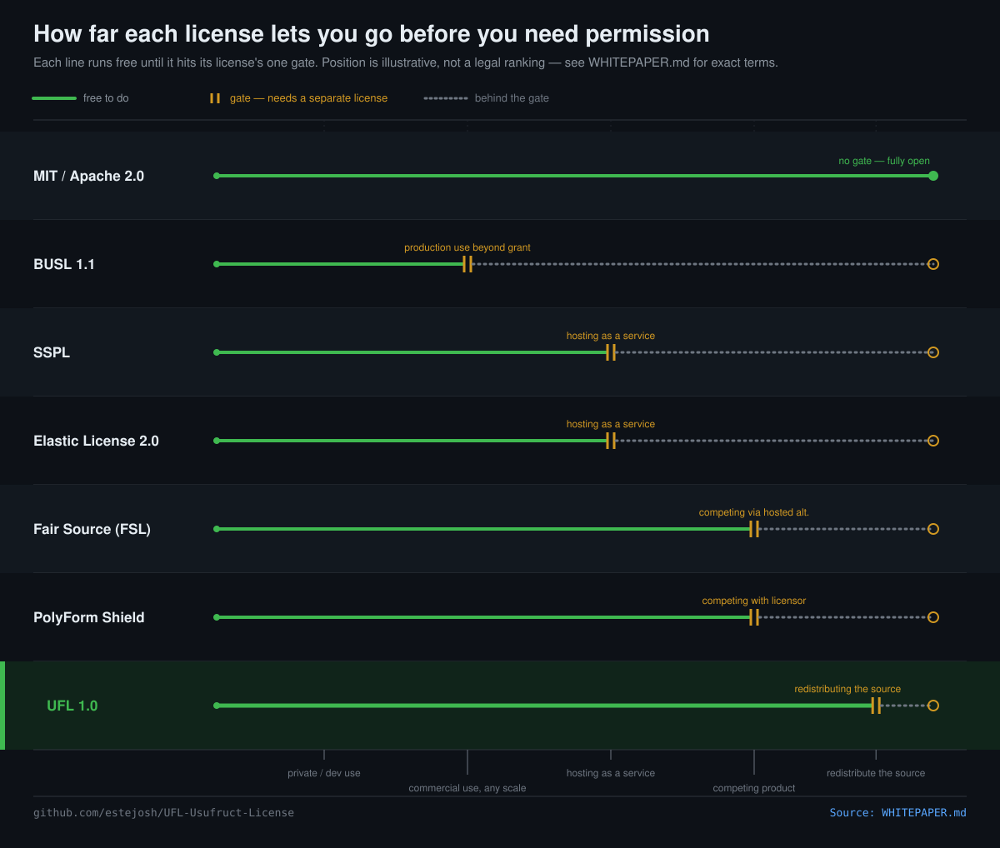

# The Usufruct License (UFL)

### A source-available license for unrestricted use and reserved redistribution

Version 3.1 — October 2026

## Abstract

Most source-available licenses gate on the wrong axis. They restrict how
*much* you can use a piece of software — production scale, seat count,
whether you're hosting it as a service, whether you compete with the
licensor. The Usufruct License gates on a different axis entirely: by
default it places no restriction on use, at any scale, for any purpose,
including commercial use — and reserves only the right to redistribute
the software itself, modified or not, to third parties. Use is free.
Redistribution is licensed.

As of version 2.0, a project adopting UFL may optionally narrow that use
grant to exactly one declared **Operational Scope** — a production
threshold, a hosting restriction, a non-compete clause, or a
noncommercial-only limit — stated once, in the open, on the license
itself. As of 3.0, the license also sets how a withheld use is paid
for: at the Licensor's published price, on UFL's own terms, with the
same acceptance, usage-statement, retroactive-license, and dispute
rules for every project. There are no side agreements and no addendum.
A project that declares no scope gets exactly the unconditional 1.0
grant this whitepaper originally described.

## The problem with existing source-available licenses

Every major source-available license answers a slightly different
question:

| License | What's free | What's gated |
|---|---|---|
| MIT / Apache 2.0 | Everything | Nothing — fully open |
| Business Source License (BUSL 1.1) | Use up to an Additional Use Grant | Production use beyond the grant, until a future Change Date converts the whole license to Apache/MIT |
| Server Side Public License (SSPL) | Use and modification | Offering it as a service — triggers an obligation to open-source your entire service stack |
| Elastic License 2.0 | Use, modification, redistribution | Offering it as a hosted/managed service to third parties |
| Fair Source / Functional Source License (FSL) | Use, including production, for a defined period | Competing by offering it as a hosted alternative; converts to Apache/MIT after ~2 years |
| PolyForm Shield 1.0.0 | Use, including commercial | Using it to build a product that competes with the licensor |
| **Usufruct License (UFL)** | **Use, at any scale, including commercial — unconditionally, or under one declared Operational Scope of the Licensor's choosing** | **Redistributing the software itself, modified or not, to third parties — always; optionally, whatever the chosen Operational Scope withholds** |

None of the existing licenses cleanly separate "you can use this
however much you want" from "you can't take the source and hand it to
someone else." BUSL, Elastic, FSL, and PolyForm all still put some limit
on *use itself* — a scale threshold, a hosting restriction, a
non-compete clause. SSPL goes the other direction and makes hosting a
service trigger a viral open-source obligation on your own stack. UFL
takes neither position by default: use is unconditional unless a
project says otherwise, and the only thing that *always* requires
permission is handing the source itself to somebody else. Where a
project does want a use-side limit — the same kind BUSL, Elastic, FSL,
or PolyForm each pick one of — UFL lets it choose exactly one, from a
fixed, named menu, rather than drafting bespoke language the way those
licenses do (see Operational Scope, below).

## The concept: usufruct

*Usufruct* is a civil-law property doctrine, older than any software
license: the right to use property belonging to another, and to enjoy
whatever benefit that use produces, without the right to alter the
property's substance or transfer it to someone else. A usufructuary can
live in the house, farm the land, keep what it produces — but can't sell
it, tear it down, or will it to their children. Ownership and the right
of disposal stay with the owner; the right of use passes freely to
whoever holds the usufruct.

That maps almost exactly onto what this license grants for software: use
it, build on it, profit from it, at whatever scale the declared
Operational Scope allows — but the right to pass the thing itself on to
somebody else stays with the licensor.

## How UFL works, plainly

**You can, without asking anyone or paying anything, within whatever
Operational Scope applies (see below):**
- Run the software.
- Deploy it, including in a commercial product or service.
- Build on top of it through its interfaces.
- Modify your own copy for your own use.

**You need a separate license to:**
- Give a copy — modified or not — to someone else.
- Fold the source into another product or service you distribute.
- Claim compatibility with or derivation from the project by name.

**You pay the Licensor's published price** for any use the project's
Operational Scope withholds, such as production use past a seat
threshold or commercial use of a Noncommercial project. That use is
then licensed under UFL itself, on the same terms as everything else
(see Paid use, below).

For a project with no declared Operational Scope beyond Unconditional,
that's the whole shape of it: no seat count,
no production threshold, no "as a service" carve-out to interpret. The
line is: does the software (or a derivative of it) leave your hands and
reach a third party as software? If yes, that's licensed. Everything
else is free. A project that has declared a narrower scope adds exactly
one more line to check, stated once, in the open, and priced in the
open too.

## Operational Scope (since 2.0)

Section 1 of the license grants unconditional use by default. As of
version 2.0, a Licensor may instead narrow that grant to **exactly one**
declared scope, stated on an `Operational Scope:` line at the top of the
license text. Scopes are never combined or stacked — a project picks one
from this menu, or none (which defaults to Unconditional):

| Scope | What it restricts |
|---|---|
| **Unconditional** (the default) | Nothing — Section 1's grant applies exactly as the Abstract describes. |
| **Seat-Limited** | Production use beyond a stated seat, device, or user threshold; non-production use stays unlimited and free. |
| **No-Third-Party-Hosting** | Offering the Software to third parties as a hosted or managed service. |
| **No-Competing-Service** | Operating the Software, or a fork of it, as a service competing with the Licensor's own offering. |
| **Noncommercial** | Commercial use of any kind. |

Section 2 (redistribution reserved) and Section 2A (the decentralized-
fork attribution carve-out, below) sit on a separate, always-on axis,
unaffected by which Operational Scope applies — narrowing or widening
Section 1's use grant never touches what Section 2 reserves.

Picking a scope is a one-time choice stated in the open, not a private
side agreement: the same text appears on the license itself, so anyone
reading a project's `LICENSE` file sees exactly what's free and what
isn't, without needing to ask.

## Forks of decentralized or network software

Section 2A, added in version 1.1, carves a specific exception out of
Section 2's redistribution reservation: if the Software is designed to
run as a node, client, or peer in a decentralized network, blockchain,
or similar peer-to-peer protocol, distributing a modified version, fork,
or independent reimplementation of it — including to operate a
*competing* network — needs no separate license, provided the fork
keeps clear, accurate attribution to the original project and preserves
the canonical-source notice. This is modeled on how Bitcoin forks are
free to compete as long as they don't hide that they're Bitcoin forks.
It does not touch Sections 2(b) or 2(c): folding the Software into
another distributed product, and using the Licensor's name or marks to
claim compatibility, still require a separate license regardless of
attribution.

## Reproducing — but not modifying — this license text

UFL is meant to work the same way everywhere it's adopted, which creates
a puzzle this whitepaper's own repository has to solve: this project's
`LICENSE.txt` *is* the UFL template, so without an explicit carve-out,
Section 2(a)'s reservation on "distributing the Software" could be read
as restricting the very act every adopter performs when they copy this
text into their own project. Section 2B, added in 2.1, closes that gap:
the text of this license may be freely copied and reproduced by anyone,
for any project, with no separate permission needed from this or any
other Licensor already using it. That permission reaches only the
license *text* — never a grant to any particular Licensor's actual
Software.

Section 2C, added in 2.2, narrows what "reproduce" means: it's a
permission to copy, not to edit. A copy of this text may fill in the
copyright year, the copyright holder, and the project name, and may make
exactly one Operational Scope choice from Section 1A's canonical menu —
nothing else in the license may be added, removed, or reworded in any
copy still presented as "the Usufruct License," "UFL," or cited by a
`LicenseRef-UFL-*` identifier. A project whose needs don't fit this text
as written is free to write its own license, including one derived from
UFL under a different name; it isn't free to alter this text and still
call the result UFL. Proposed changes go to the canonical source
(Section 7) for consideration in a future official version — adopted
proposals become a new version, never a retroactive edit to one already
published.

## Paid use (since 3.0)

Four of the five Operational Scopes withhold something from the free
grant. Through 2.2, the license said those uses needed "a separate
written license" and stopped there. That left the scopes promising a
paid path the license never described, and every Licensor writing its
own side terms to fill the gap, which is exactly the fragmentation
Section 2C exists to prevent. Version 3.0 writes the whole path into
the license, identical for every project:

- **Paid Use (Section 8).** A withheld use is licensed under UFL itself
  when the Licensee pays the Licensor's Published Price. The price can
  be per seat, per device, per year, or tiered, but it is only a
  number. It cannot add or change a term.
- **Seats and production (Section 1B).** Seats are counted by role, not
  by who runs the software. Evaluation, development, testing, and demos
  are Non-Production Use; real work and finished output are not.
- **Acceptance (Section 9).** Using the Software is acceptance. A
  scoped project must show a click-through or prompt naming the version
  before first use, recorded only on the user's own machine. The user
  acknowledges the software is under copyright whether or not it is
  registered, and that withheld use without a license is outside the
  license.
- **Usage statements, not surveillance (Section 10).** For scoped
  projects, the Licensor may ask once a year for a signed, content-free
  statement of use. The license never requires or permits the software
  to report usage back for enforcement.
- **Output marks (Section 11).** Disclosed marks showing what produced an
  output and under which license state. No user identity, no content.
- **Retroactive licenses (Section 12).** Use past the scope without
  paying is licensed after the fact: the published price if the user
  discloses it first, three times the published price if the Licensor has to
  find it, plus interest, three years back at most. The license is free
  for almost everything; the one thing it asks is that withheld use be
  paid for. Up front or self-disclosed costs list price. Getting found
  costs more.
- **Never revoked (Section 13).** The use grant is perpetual. A user who
  owes money keeps using the software and is brought current by paying
  or by a written payment agreement.
- **Disputes (Section 14).** California law. Mediation within 30 days,
  binding arbitration in California after 60, both available entirely
  by video. Court injunctions stay available for unlicensed
  redistribution.
- **Entire license (Section 15).** No other document adds to or changes
  the license. A Licensor chooses a version and a scope and publishes a
  price. That's all.

## Contributions (since 3.1)

Through 3.0, Section 4 said contributions were accepted under the same
terms and granted back to the Licensor "to the extent necessary to keep
this license enforceable." That is a thin hook. It does not say the
Licensor may relicense a fix, include it in a paid version, or carry it
into a future version of the license, and it says nothing about patents
or about whether the person submitting had the right to. 3.1 replaces it
with what a project that lives on its users' fixes needs:

- **A license, not an assignment.** The author grants the Licensor a
  perpetual, worldwide, irrevocable, royalty-free, non-exclusive license
  and keeps ownership. Contributors accept this far more readily than a
  transfer of copyright, and it gives the Licensor what it needs.
- **The right to relicense.** The license runs "under this license or any
  other terms." A fix that could only ever be used under the version it
  arrived in would be stranded the first time the project moves to a new
  version.
- **Patents.** The grant includes the author's patent rights that the fix,
  alone or combined with the Software, would infringe. Without that, a
  contributor could hand over code and keep the right to sue over it.
- **Nothing owed.** No fee, now or later. This is the tradeoff for using
  the project: a fix you send is free to the project for good.
- **Authority.** An author submits only what the author can license. If an
  employer or client has rights in the work, the author needs that party's
  authority first.
- **Submitting is agreeing.** No signature is needed for the grant to
  take effect. That matters because the grant must hold even where the
  recorded step is missed or contested.

Why the CLA is a record and not a contract. Section 15 says no other
document adds to or changes the license's terms, and Section 2C says the
same of any separate document. A conventional CLA is a separate document
with terms of its own, which would put it at odds with both. So the terms
live in Section 4, and the last paragraph of Section 4 lets a Licensor
require a recorded step. That step records agreement to Section 4 and adds
no term. Section 15 recognizes it by name.

Why a CLA record and not a DCO sign-off. A `Signed-off-by` line certifies
the right to submit under the project's license, and the standard
certificate is worded around open-source licenses, which UFL is not. It
also lives in the commit message. A squash merge, which many projects use,
replaces the contributor's commits with one commit authored by whoever
merged, so the contributor's own signature is gone from the history, and a
trailer survives only if the merge message happens to keep it. A CLA record
lives outside the commit, tied to the contributor's account, and does not
depend on how the merge is done.

What git can and cannot do. Git is a content tracker; it cannot make
anyone agree to anything. GitHub can, in effect, refuse to merge until
agreement is on record: a required status check that fails until the
author signs, branch protection that makes the check mandatory, and
signed commits for identity. That controls what a project accepts. It
does not reach a fork nobody submits, a patch sent by email, or a fix
someone keeps to themselves, and it is not meant to: Section 4 covers what
is submitted. The kit in `templates/cla/` sets this up, and the README
lists what it does and does not do.

This section explains a drafting choice. Whether a given court or
jurisdiction enforces the grant as written, and how the recorded
acknowledgement is weighed, depends on where and against whom it is
asserted.

## Naming: why "Usufruct" over the alternatives

Two other names were considered before settling on Usufruct.

**Open Custody License (OCL).** "Custody" describes the same posture —
holding something in trust, without full transfer rights — and would
have tied naturally to Custodly, the first project shipped under this
license. It was set aside for exactly that reason: a license name that
reads as tied to one project's brand doesn't travel. A future adopter of
this license, on an unrelated project, shouldn't have to explain that
"Custody" here has nothing to do with the word "Custodly."

**Sovereign Use License (SUL).** "Sovereign" already runs through this
portfolio's language — a sovereignty-first thesis behind other projects
in it, a roadmapped "sovereign vault," a "Sovereign Intelligence Node."
The license does grant sovereign, unencumbered use rights, so the name
fit thematically. It was set aside because "sovereign" describes the
*quality* of the grant (unencumbered, no one can take it from you) but
not its *shape* (use freely, don't redistribute) — and a stranger's
legal team reading it cold gets less precise information from "sovereign"
than from a term that names the actual legal mechanism.

Usufruct won because it's not a coined phrase — it's borrowed from
centuries of actual property law, so it reads as a precise description
of the grant rather than as marketing language, whether the reader is a
developer who's never heard the word or a lawyer who has.

## FAQ

**Is this open source?**
No. The Open Source Definition requires unrestricted redistribution
rights, and this license intentionally withholds those — and, depending
on which Operational Scope a project declares, may withhold some uses
the Definition also requires to be unrestricted. It's source-available:
the code is public and free to read, and free to use subject to whatever
scope applies, but redistribution is reserved.

**Is UFL an SPDX-recognized identifier?**
No. SPDX maintains a curated list of license identifiers, and UFL isn't
on it — inclusion requires a submission process this project hasn't
gone through. Until it is (if ever), the correct SPDX-style reference is
`LicenseRef-UFL-3.1` (with a scope suffix where one applies, e.g.
`LicenseRef-UFL-3.1-N` for Noncommercial), the convention SPDX defines
for licenses outside its list — not a bare `UFL-3.1` as if it had been
registered.

**Can I use UFL-licensed software in a commercial product?**
Yes, within whatever Operational Scope the project has declared (the
Noncommercial scope is the one exception, by design), as long as you're
not redistributing the licensed software's own source (modified or not)
as part of doing so. Building a product that *uses* it is free. Building
a product *out of* its source and shipping that source to your customers
requires a license.

**Can I fork it for my own internal use?**
Yes — modifying your own copy for your own use is covered under Section
1, within whatever Operational Scope applies. What requires a license is
giving that modified copy to anyone else.

**What's an Operational Scope, and why isn't "Unconditional" the only
option?**
Because some projects have a real reason to put a limit on use itself —
a free tier for small deployments with a paid tier past some threshold,
a wish not to be undercut by a hosted clone, a noncommercial-only
research release — and UFL would rather offer those projects one of a
small, named, publicly legible set of options than leave them to draft
bespoke restriction language (which is how most source-available
licenses end up hard to compare to one another). See Operational Scope,
above, for the full menu.

**Can a project attach its own fees, acceptance steps, or audit rights
on top of UFL?**
No. As of 3.0 those terms are already in the license, the same for
every project (Sections 8 through 15). A project sets one thing beyond
its scope: the price of a withheld use, published in its repo or docs.
Section 15 gives any other document no effect on the license's terms.

**What happens if someone uses a scoped project past its limit without
paying?**
They owe a Retroactive License under Section 12: the published price if
they tell the Licensor first, three times the published price if the Licensor
finds it, plus interest, reaching back at most three years. Their right
to use the software is not revoked; they keep using it and are brought
current by paying or by a written payment agreement (Section 13).

**Can I modify the license text itself — trim a section, reword a
clause, add my own term?**
No, not and still call it UFL. Section 2B permits copying this text;
Section 2C limits that to filling in the three placeholders and picking
one Operational Scope. Anything else makes it a different license —
which you're free to write, including as a derivative of this one under
its own name — but not UFL.

**Does UFL convert to a fully open license after some period, like BUSL
or FSL do?**
Not as of this version. That's an open question for a future version
rather than a decision made here.

**Can I get a redistribution license?**
That's between you and whoever holds the copyright on the specific
project — UFL is the license template, not a registry. Check that
project's LICENSE file for contact terms.

## Versioning

Each version of UFL is dated and its text is fixed once published —
nothing is edited retroactively, only superseded by a later version. A
project states which version (and, since 2.0, which Operational Scope)
it's under, and that pinning doesn't move unless the project itself
updates it:

- **1.0** (September 2026) — initial release: Section 1's unconditional
  use grant and Section 2's redistribution reservation.
- **1.1** — added Section 2A, the decentralized-fork attribution
  carve-out.
- **2.0** — added Section 1A, Operational Scope, letting a project
  narrow Section 1 to one of five declared scopes.
- **2.1** — added Section 2B, permission to reproduce the license text
  itself without separate permission.
- **2.2** — added Section 2C, Version Fidelity: reproduction under 2B is
  limited to the placeholders and a scope choice, nothing else.
- **3.0** — paid use built into the license: definitions (1B), Paid
  Use at the Licensor's published price (8), acceptance (9), usage
  statements (10), output marks (11), retroactive licenses (12),
  no revocation (13), disputes (14), and entire license (15).
- **3.1** — contributions: Section 4 now grants the Licensor a perpetual,
  irrevocable, royalty-free license to every contribution (patents and
  relicensing included), with a recorded-acknowledgement step that adds no
  term; Section 15 recognizes that step.

See [`CHANGELOG.md`](./CHANGELOG.md) for the full text of each entry.
Full version history is preserved in this repository's Git history and
is never force-pushed or rewritten.

## Adoption

First shipped as UFL-1.0 with [Custodly](https://github.com/estejosh/Custodly)
(2026); adopted at UFL-1.1 by [Hone](https://github.com/shindevlin/hone).
At UFL-2.2: [ferryman](https://github.com/estejosh/ferryman)
(Seat-Limited), [graea](https://github.com/estejosh/graea)
(No-Third-Party-Hosting), [oddsports](https://github.com/estejosh/oddsports)
(Noncommercial), [agent-comm-channel](https://github.com/estejosh/agent-comm-channel)
(Noncommercial), and [bullship_public](https://github.com/estejosh/bullship_public)
(No-Competing-Service). See the README's
[Adopted by](./README.md#adopted-by) table for the current, authoritative
list.
